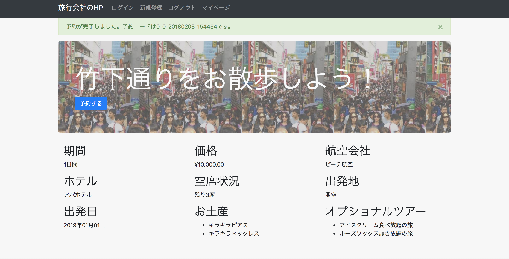

+++
author = "Kenji Adachi"
title = "[Rails]paramsにform以外の値を入れたい！と思ってるあなたへ"
date = "2018-02-04"
description = "一意な予約コードを自動生成する必要があるなど、ちょっとしたときに便利ですね"
tags = ["Rails", "params"]
categories = ["Rails"]
images  = ["img/header/how-to-put-a-value-other-than-form-in-params.png"]
type = "post"
draft =  false
+++

先日、大学の課題で[こんなもの](https://arcane-hamlet-34891.herokuapp.com/)を作ってみました。

簡単な旅行予約サイトのイメージです。

その中で、少し困ったことがあったのでメモしておきます。

--------

**※こちらの記事は、Qiitaにて公開していたものを2020/03/01にこちらに移行しています。**

元記事は[こちら](https://qiita.com/dach1_ken/items/2300004efb4afe638303)

※現在はこちらのページのURLのみ記載されています。

--------

## やりたかったこと

予約コードを自動生成したかった。

ログイン後に、旅行の詳細ページに飛ぶと登場する「予約する」ボタンを押すと、一意な予約コードを自動生成する必要があり、悩みました。



この予約コードを自動生成するために、最初送られてきたparamsからごちゃごちゃしようと思ってたのですが、どうにも難しそうでした。

modelで何か触るんだろうなーと思って調べたのですが、いい方法が見つからず…

------

## 結果

このように、hidden_fieldでなんとかするようにしました。

```erb
app/views/tours/show.html.erb

<%= simple_form_for([@tour, @booking]) do |f| %>
 <%= f.hidden_field :customer_id, :value => current_customer.id %>
 <%= f.hidden_field :tour_id, :value => @tour.id %>

　　<%# これが予約コード %>
 <%= f.hidden_field :booking_code, :value => "#{current_customer.id}-#{@tour.id}-#{Time.new.strftime("%Y%m%d-%H%M%S")}" %>

 <%= f.submit '予約する', class: 'btn btn-primary' %>
<% end %>
```

このように、予約コードもむりやりviewの中で作らせました。

一意なものにするために、`customer_id`と`tour_id`と現在時刻をハイフンで繋げたものにしています。

値を加工して作らなくても、加工した値をparamsとして渡してあげたほうが楽だなーと。

viewで加工するのはよくないとは思うのですが、簡単なものならこれでも良さそうだと思います。

もしよければ[githubにも公開](https://github.com/kenjiadachi/advanced_software_theory)しているので触ってみてください。
