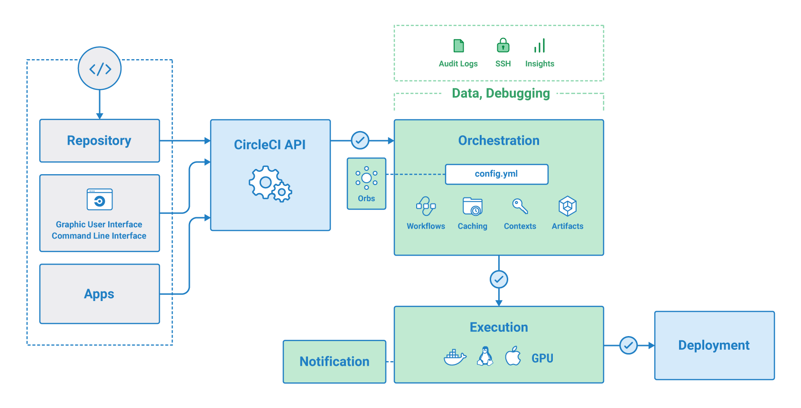

+++
author = "Kenji Adachi"
title = "[CircleCI]CircleCIを上手に使おう"
date = "2020-08-02"
description = "自動デプロイやテストチェック、コード規約チェックなど"
tags = ["Rails", "refactor"]
categories = ["Rails"]
images  = ["img/header/how-to-use-circleci.png"]
type = "post"
draft =  false
+++

CIツールで企業では一番ポピュラーに使われているのでは？というCircleCI。

使いはじめはPRを作成する度怒られてイラだちを覚えるツールでしたが、今はすっかり通った時の快感に魅了されています。

今回は、そんなCircleCIを使いこなせるようになりたいということで自分の環境に追加してみたので、そのやり方をご紹介します。

-------

<!--more-->

## ことばの紹介

まずは知らない方もいるかと思うので、ことばの紹介から。

わかってるよ！って人は飛ばしてください。

-------

### CircleCIとは

[CircleCIの公式ドキュメント](https://circleci.com/docs/ja/2.0/about-circleci/)からとってきました。

> CircleCI- CircleCI のミッションは、テクノロジー主導型の組織が最高の成果を上げられるようにサポートすることです。

> インテリジェントな自動化を通して、エンジニアリング チームの生産性を向上させます。

> CircleCI は、エンタープライズ クラスのサポートとサービスを提供すると共に、高い柔軟性によってスタートアップにも対応しています。

> Linux、macOS、Android、Windows、さらに SaaS やファイアウォールの内側など、必要な場所で動作します。



めっちゃわかりやすい図ですね…

とりあえず、GitHubにPRを作成するといい感じにチェックをしてくれるやつです。

今回はrailsのテストやコードチェックを行いましょう。

-------

## 使ってみましょう

それでは早速使っていきましょう。

今回は、下記の4つをやってみます。

- rspecの実行
- rubocopによる静的コード解析
- rails_best_practicesによる静的コード解析
- codecovによるカバレッジテスト


まずはgemfileに追加しましょう。

```
# gemfile

group :development, :test do
  # Call 'byebug' anywhere in the code to stop execution and get a debugger console
  gem 'byebug', platforms: [:mri, :mingw, :x64_mingw]
  # testツール
  gem 'rspec-rails'
  gem 'factory_bot_rails'
  # コーディング規約
  gem 'rails_best_practices'
  # CircleCIでテストするよう
  gem 'rspec_junit_formatter'
  # 静的コード解析
  gem 'rubocop'
  # testカバレッジ
  gem 'codecov'
end

```

```
# .circleci/config.yml

version: 2.1

orbs:
  slack: circleci/slack@3.4.2
  codecov: codecov/codecov@1.1.1

executors:
  default:
    working_directory: ~/app
    docker:
      - image: circleci/ruby:2.6.3-node
        environment:
          - BUNDLER_VERSION: 2.0.2
          - RAILS_ENV: 'test'
          - RAILS_ENV: test
          - PGHOST: 127.0.0.1
          - PGUSER: root
      - image: circleci/postgres:9.6.2-alpine
        environment:
          - POSTGRES_USER: postgres
          - POSTGRES_DB: app_test

commands:
  setup_database:
    steps:
      - run: mv ./config/database.ci.yml ./config/database.yml
      - run:
          name: Database setup
          command: |
            bundle exec rake db:create
            bundle exec rake db:schema:load

jobs:
  build:
    executor:
      name: default
    steps:
      - checkout
      - restore_cache:
          keys:
            - gem-cache-{{ arch }}-{{ .Branch }}-{{ checksum "Gemfile.lock" }}
            - gem-cache-{{ arch }}-{{ .Branch }}
            - gem-cache
      - run:
          name: install dependencies
          command: |
            gem install bundler -v 2.0.2
            bundle check --path=vendor/bundle || bundle install --path vendor/bundle --clean --jobs 4 --retry 3
      - save_cache:
          paths:
            - ./vendor/bundle
          key: gem-cache-{{ arch }}-{{ .Branch }}-{{ checksum "Gemfile.lock" }}
      - setup_database
      - persist_to_workspace:
          root: .
          paths: vendor/bundle
  test:
    executor:
      name: default
    steps:
      - checkout
      - attach_workspace:
          at: ~/app
      - restore_cache:
          keys:
            - gem-cache-{{ arch }}-{{ .Branch }}-{{ checksum "Gemfile.lock" }}
            - gem-cache-{{ arch }}-{{ .Branch }}
            - gem-cache
      - run:
          name: install dependencies
          command: |
            gem install bundler -v 2.0.2
            bundle check --path=vendor/bundle || bundle install --path vendor/bundle --clean --jobs 4 --retry 3
      - save_cache:
          paths:
            - ./vendor/bundle
          key: gem-cache-{{ arch }}-{{ .Branch }}-{{ checksum "Gemfile.lock" }}
      - setup_database
      - run:
          name: Run rails best practice
          command: bundle exec rails_best_practices
      - run:
          name: Run rubocop
          command: bundle exec rubocop
      - run:
          name: Run rspec
          command: |
            bundle exec rspec \
              --format progress \
              --format RspecJunitFormatter
      - store_test_results:
          path: test_results
      - codecov/upload:
          file: test_results/rspec.xml
      - slack/status:
          webhook: '${SLACK_WEBHOOK}'
workflows:
  version: 2
  build_and_test:
    jobs:
      - build
      - test:
          requires:
            - build

```

ポイントを解説していきますね。

-------

### orbsとは

[公式ドキュメント](https://circleci.com/docs/ja/2.0/jobs-steps/#orbs-%E3%81%AE%E6%A6%82%E8%A6%81)にわかりやすい説明があったので引用します。

> Orbs は、名前に基づいてインポートするかインラインで構成する、設定ファイルのパッケージです。

> プロジェクト内またはプロジェクト間で共有および再利用して、構成作業を簡略化することができます。

ということで、まあざっくりパッケージみたいなものですね。

今回は

- [slackメッセージ通知用のOrb](https://circleci.com/orbs/registry/orb/circleci/slack)
- [codecov連携用のOrb](https://circleci.com/orbs/registry/orb/codecov/codecov)

の2つを入れています。

-------

### executorsとは

こちらも[公式ドキュメント](https://circleci.com/docs/ja/2.0/configuration-reference/#executors-version-21-%E3%81%8C%E5%BF%85%E9%A0%88)から引用です。

> executors では、ジョブのステップを実行する環境を定義します。

> これにより、複数のジョブで 1 つの Executor 定義を再利用できます。

ということで、別のjobでも同様の環境で実行する際にはこちらのexecutorsに定義しておくと共通で使用できるようになります。

今回は、`build`、`test`の2つのjobがあるので、executorsで環境を定義しました。

-------

### commandsとは

またも[公式ドキュメント](https://circleci.com/docs/ja/2.0/configuration-reference/#commands-version-21-%E3%81%8C%E5%BF%85%E9%A0%88)から引用です。

> commands では、ジョブ内で実行する一連のステップをマップとして定義します。

> これにより、複数のジョブで 1 つのコマンド定義を再利用できます。

ということで、複数ジョブをまとめて定義しておけます。

今回は`setup_database`というコマンドを定義しています。

単純にDB周りの設定をまとめているだけですね。

-------

### workflowsとは

はい。[公式ドキュメント](https://circleci.com/docs/ja/2.0/configuration-reference/#workflows)ですね。

> すべてのジョブのオーケストレーションに使用します。

> 各ワークフローは、キーとなるワークフロー名と、値となるマップで構成します。

> 名前は、その config.yml 内で一意である必要があります。 

> ワークフロー構成の最上位のキーは version と jobs です。

ということで、jobの順番を指定したりできるやつですね。

今回の場合は`build`と`test`のjobを切り分けて、その順番をworkflowで指定しています。

`test`に`requires`で`build`を指定することで、`build`→`test`の順になるように指定しています。

-------

### restore_cache/keysとは

`restore_cache`はキャッシュを読み込む系のやつですね。

`workspace`の構築などをキャッシュから行えるので高速化できます。

配下にあるこれらは読み込むキャッシュのkeyですね。

```
keys:
  - gem-cache-{{ arch }}-{{ .Branch }}-{{ checksum "Gemfile.lock" }}
  - gem-cache-{{ arch }}-{{ .Branch }}
  - gem-cache
```

-------

### save_cache/keysとは

`save_cache`はキャッシュを保存します。

上記の`restore_cache`で読み込むためのキャッシュを作成します。

配下にあるこれらは作成するキャッシュのkeyですね。

```
keys:
  - gem-cache-{{ arch }}-{{ .Branch }}-{{ checksum "Gemfile.lock" }}
  - gem-cache-{{ arch }}-{{ .Branch }}
  - gem-cache
```

-------

## 参考にした記事

- [CircleCIを設定する - CircleCI](https://circleci.com/docs/ja/2.0/configuration-reference/)
